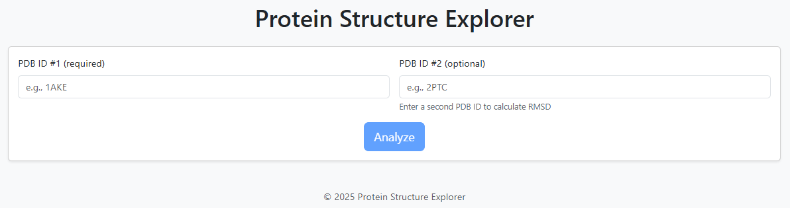

# Protein Structure Explorer

[](https://github.com/your_username/Protein_Explorer/actions/workflows/ci.yml)
[](./LICENSE)
[](https://hub.docker.com/r/katezu/protein-explorer)
[](https://katezuu.github.io/Protein_Explorer/)

**Protein Structure Explorer** is a small web app that lets you fetch any entry from the RCSB PDB, view the 3‑D structure directly in the browser, and run quick exploratory analyses — C‑alpha scatter, Ramachandran maps, pairwise RMSD and single‑point mutation metrics.



---

##Key Features

* **Instant fetch** of both `.pdb` **and** `.cif/mmCIF` (with caching & automatic retries).  
* Interactive 3‑D viewer powered by **NGL**.  
* Built‑in charts (**Plotly**) – Cα scatter (3‑D) & Ramachandran plot.  
* **Pairwise alignment & RMSD** for any two PDB IDs.  
* **Single‑point mutation** modelling with RMSD & COM‑shift, highlighted in the viewer.  
* Simple **REST API** endpoints.  
* **Sphinx** documentation & auto‑generated API reference.  
* Ready for **Docker** / CI / GitHub Pages deployment.

---

## Quick Start

```bash
git clone https://github.com/katezuu/Protein_Explorer.git
cd Protein_Explorer
python -m venv .venv && source .venv/bin/activate     # Windows: .venv\Scripts\activate
pip install -r requirements.txt
flask --app app run            # open http://127.0.0.1:5000
```

---

## Project Layout

```
Protein_Explorer/
├── app.py               # Flask routes / API
├── explorer.py          # I/O, metrics, plotting, mutation (monolith)
├── templates/           # index.html, result.html
├── static/js/script.js  # client‑side logic
├── docs/                # Sphinx sources
├── tests/               # pytest suite
├── Dockerfile / Procfile
└── .github/workflows/ci.yml
```

---

## Documentation

Inside `docs/`:

```bash
cd docs
make html          # outputs to docs/_build/html
```

Set up **GitHub Pages** to serve `gh-pages` branch or enable the provided workflow.

---

## Testing

```bash
pytest -q
```

---

## Docker

```bash
docker build -t protein-explorer .
docker run -p 5000:5000 protein-explorer
```

---

## Acknowledgements

* **RCSB PDB** data.  
* **BioPython** for parsing PDB / mmCIF.  
* **NGL** for WebGL rendering.  
* **Plotly** for the interactive charts.  
* **Bootstrap 5** for UI components.

---

## License

Released under the MIT License – see [`LICENSE`](LICENSE) for details.
