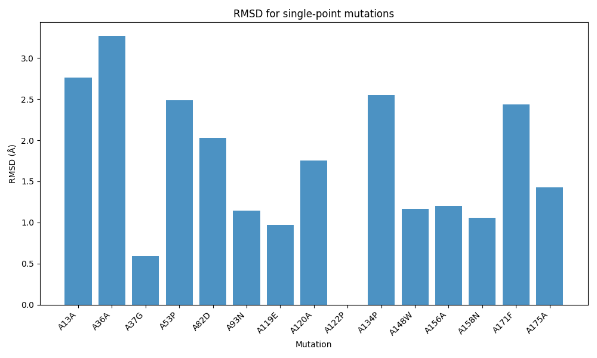
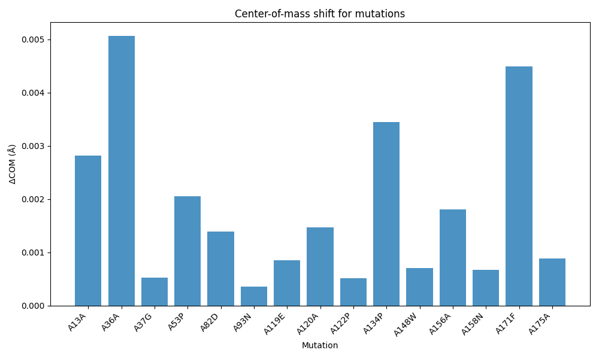

Analysis
========

Once you’ve run your batch of mutations (e.g. via ``run_mutation_batch.py``), you’ll get:

- A CSV with columns: residue_number, original, mutated, category, chain, mutation, rmsd, com_shift.
- Plots showing how each mutation affects structure.

RMSD per Mutation
-----------------

Center‐of‐Mass Shift per Mutation
---------------------------------

Interpretation
~~~~~~~~~~~~~~

- **High RMSD** indicates large backbone perturbations.
- **High COM shift** signals significant repositioning of the mutated residue.

