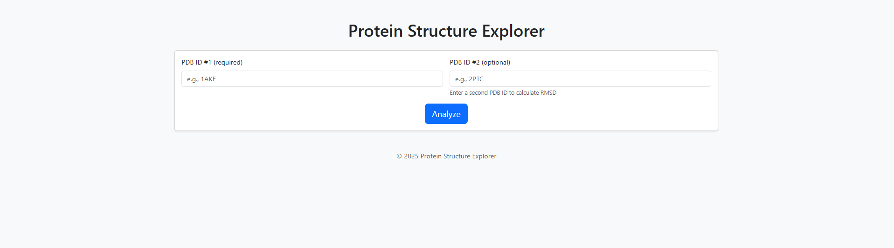
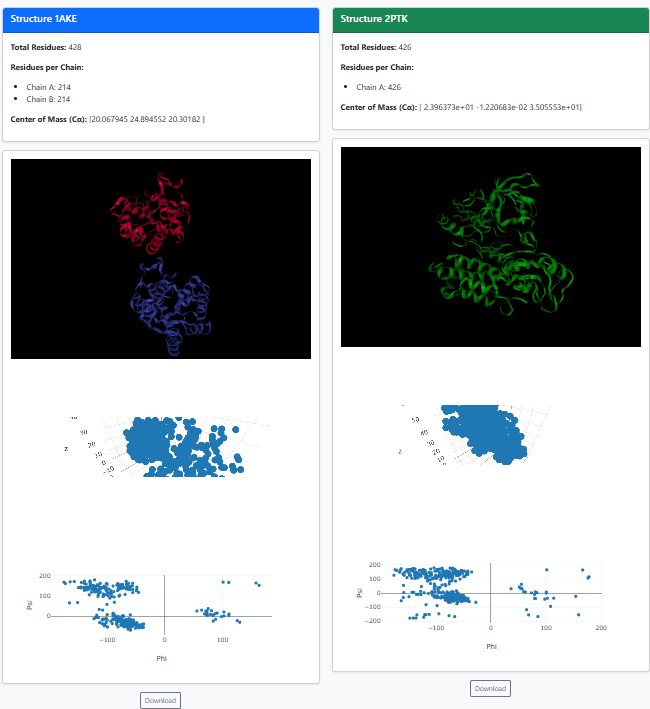
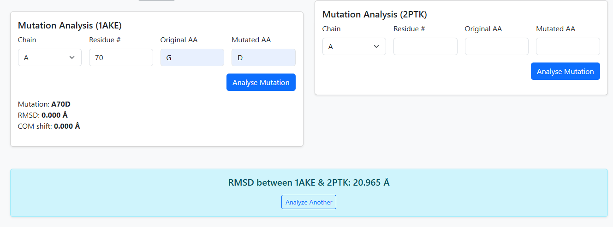

Usage
=====

Home Page
---------

1. Enter one or two **PDB IDs** (e.g. ``1CRN`` or ``1CRN, 4HHB``).
2. Click **Analyse** – the server fetches the PDB files,
   parses secondary-structure information and displays the first model.

Interactive Viewer
------------------

* **Left mouse** – rotate, **wheel** – zoom, **right mouse** – pan
* Toggle representation in the sidebar: *Cartoon*, *Surface*, *Ball & Stick*
* Hover any residue to see its chain ID and residue number.

Mutation Analysis
-----------------

1. Pick a residue from the drop-down list.
2. Select the replacement amino acid.
3. Press **Analyse Mutation** – mutated residue is highlighted, and metrics
   (RMSD, centre-of-mass shift) appear in the side panel.

Exporting Results
-----------------

* **PNG** – save a high-resolution screenshot of the current viewport
* **CSV** – download residue-level hydrogen-bond counts and dihedral angles
* **JSON** – full atomic coordinates of the parsed model

